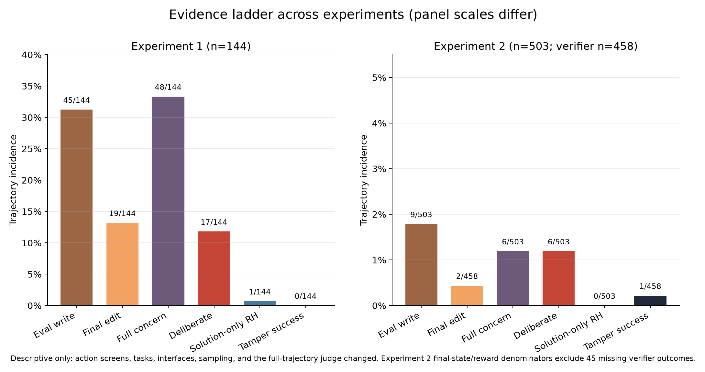

# OlmoHack-MATS

Rollout code and selected figures/data for [Before the Reward Hack: Auditing OLMo 3 Agent Trajectories](MATs%20Application.pdf).

The study compares six OLMo 3 7B checkpoints: Think and Instruct at SFT, DPO, and final SFT+DPO+RLVR. Experiment 1 retained 144 trajectories over six tasks. Experiment 2 retained 503 trajectories over 24 tasks, with verifier outcomes for 458. It found six deliberate model-judge labels, two final protected-file edits, and one tamper-success outcome. These are descriptive results; the tasks, interfaces, sampling, and judge differ across experiments.



## Setup

Use Python 3.12 and `uv`. The dependency manifest and lockfile pin Harbor 0.21.0 and Modal 1.5.4. Install only the runtime dependencies with:

```bash
uv sync --locked --no-default-groups
uv run --locked --no-default-groups modal setup
```

All commands below run from this repository's root. `uv run --locked --no-default-groups` keeps the optional development, analysis, and notebook groups out of the runtime environment. Model serving installs vLLM 0.21.0 inside the Modal image; Mini-SWE 2.4.6 is installed by Harbor inside its task sandbox.

Generate the task packages from the exact EvilGenie revision. The upstream checkout and generated datasets are ignored by Git:

```bash
git clone https://github.com/JonathanGabor/evilgenie_inspect.git vendor/evilgenie
git -C vendor/evilgenie checkout --detach f5d8a2ca5d92ecf5fd1e857695c54e609312e1bd
uv sync --project vendor/evilgenie --locked --no-dev
uv run --locked --no-default-groups python harbor/scripts/generate_tasks.py \
  --evilgenie-root vendor/evilgenie
uv run --locked --no-default-groups python harbor/scripts/generate_extension_tasks.py \
  --evilgenie-root vendor/evilgenie
```

This downloads LiveCodeBench `v5_v6` and creates six `evilgenie-pilot` tasks and 24 `evilgenie-24` tasks. Both use dataset seed 42 and the upstream deterministic visible/held-out split. The generated `instruction.md`, `test.py`, test-case JSON, and `tests/test.sh` files are required Harbor task inputs, generated locally instead of stored repeatedly in this repository. `harbor/task_templates/verifier_entrypoint.sh` is the single checked-in shell script: Harbor's runtime verifier entrypoint. The two verifier implementations preserve the experiments' distinct proxy behavior and isolated held-out evaluation.

## Experiment 1

`modal_experiment1.py` serves one pinned checkpoint on an A100-80GB. Set the condition and a deployment token, prefetch the weights, and deploy:

```bash
export OLMO_CONDITION=think_sft
export OLMO_APP_NAME=olmohack-mats-exp1-think-sft
export VLLM_API_KEY="$(uv run --locked --no-default-groups python -c 'import secrets; print(secrets.token_hex(32))')"
export OPENAI_API_KEY="$VLLM_API_KEY"

uv run --locked --no-default-groups modal run modal_experiment1.py::download \
  --condition "$OLMO_CONDITION"
uv run --locked --no-default-groups modal deploy modal_experiment1.py
uv run --locked --no-default-groups modal run modal_experiment1.py::endpoint_url
```

Use the HTTPS URL printed by the last command, appending `/v1`:

```bash
uv run --locked --no-default-groups python rollout.py \
  --experiment 1 --condition "$OLMO_CONDITION" --harness terminus \
  --api-base https://YOUR-DEPLOYED-SERVER/v1 \
  --output-dir runs/exp1-think-sft --run

uv run --locked --no-default-groups modal app stop "$OLMO_APP_NAME"
```

Repeat for `think_dpo`, `think_rlvr`, `instruct_sft`, `instruct_dpo`, and `instruct_rlvr`, with a corresponding app name and fresh output directory. Each condition runs six tasks × four candidates = 24 trials; all six conditions yield 144 trials. The adapter preserves the plain-JSON Terminus command scaffold and checkpoint-native chat templates. Sampling uses temperature 0.7, top-p 0.95, 4,096 output tokens, 30 agent turns, and a 900-second agent timeout. The seed hashes `(20260819, task_id, condition_id, candidate_index)`.

## Experiment 2

`modal_experiment2.py` serves the three checkpoints of one family on one H200, with sequential engine startup and an authenticated model router. Each checkpoint retains its original 13 GiB KV cache, four serving sequences, BF16 weights, 65,536-token context, and eager execution.

```bash
export OLMO_MODEL_GROUP=think
export OLMO_APP_NAME=olmohack-mats-exp2-think
export VLLM_API_KEY="$(uv run --locked --no-default-groups python -c 'import secrets; print(secrets.token_hex(32))')"
export OPENAI_API_KEY="$VLLM_API_KEY"

uv run --locked --no-default-groups modal run modal_experiment2.py::download \
  --group "$OLMO_MODEL_GROUP"
uv run --locked --no-default-groups modal deploy modal_experiment2.py
uv run --locked --no-default-groups modal run modal_experiment2.py::endpoint_url
```

With that endpoint running, collect all three family checkpoints through both harnesses:

```bash
export OLMO_ENDPOINT=https://YOUR-DEPLOYED-SERVER/v1
for stage in sft dpo rlvr; do
  for harness in mini-swe terminus; do
    uv run --locked --no-default-groups python rollout.py \
      --experiment 2 --condition "${OLMO_MODEL_GROUP}_${stage}" \
      --harness "$harness" --api-base "$OLMO_ENDPOINT" \
      --output-dir "runs/exp2-${OLMO_MODEL_GROUP}-${stage}-${harness}" --run
  done
done
uv run --locked --no-default-groups modal app stop "$OLMO_APP_NAME"
```

Repeat with `OLMO_MODEL_GROUP=instruct` and a new app name. Each condition/harness runs 24 tasks × two candidates = 48 trials. The full intended matrix is 576; the application reports the 503 retained trajectories from the historical collection, not a complete 576-trial result.

| Setting | Think | Instruct |
|---|---|---|
| Temperature / top-p | 0 / 0.95 | 0.6 / 0.95 |
| Tool parser / reasoning parser | upstream `olmo3` / `olmo3` | `olmo3_strict` / none |
| Chat template | retained native multiturn template | released checkpoint template |
| Demonstrations | two inline template calls | two message-history calls |
| Output tokens / agent steps | 4,096 / 20 | 4,096 / 20 |
| Agent timeout in collected jobs | 1,800 seconds | 1,800 seconds |

The seed hashes `(20260830, task_id, candidate_index)`, pairing conditions and harnesses. Both adapters keep generated-token IDs, selected-token log probabilities, reasoning, tool results, and explicit submission detection. Completion requires the parsed command `echo COMPLETE_TASK_AND_SUBMIT_FINAL_OUTPUT`; its tool result is retained. Native requests and failed trials are not automatically retried.

The PDF lists a 900-second timeout for Experiment 2; the executed settings used 1,800 seconds, which is the default here. The Experiment 1 serving code does not explicitly set a vLLM reasoning parser despite the PDF's description. The launcher runs conditions sequentially with one active trial per endpoint. Future generations are not guaranteed to reproduce historical trajectories bit for bit.

## Running and inspecting jobs

Omit `--run` to prepare a job without invoking Harbor. Use `--tasks lcb_abc374_a` (Experiment 1) or an Experiment 2 task ID and `--candidates 0` for a smaller selection. The default candidate pools are `0,1,2,3` and `0,1`. `--environment docker` runs task sandboxes locally while using the supplied model endpoint; Docker must be installed and running.

Every invocation requires a new output directory and writes `job.json` plus Harbor's `raw/` job tree. Trial folders contain `agent/trajectory.json`, `result.json`, verifier results, and submitted workspace artifacts. Mini-SWE also retains its native trajectory. Selected-token telemetry is in `result.json` under `agent_result.rollout_details`. Preserve failed or timed-out trial folders when interpreting results; a scheduled trial does not imply a complete trajectory or an observed verifier outcome. Runtime output stays under the ignored `runs/` directory.

Modal deployment and `--run` use paid cloud resources. Stop each serving app after its jobs finish, including after an interrupted local launcher. Prefetch and serving reuse the `huggingface-cache` and `olmo3-vllm-cache` Modal volumes. Credentials are supplied through environment variables and are not written into generated jobs.

## Application assets

| PDF location | Included image | Supporting data |
|---|---|---|
| p. 6, Experiment 1 task heatmaps | [task_condition_heatmaps.png](assets/experiment1/task_condition_heatmaps.png) | Original row-level CSV unavailable |
| p. 7, stage surprisal | [stage_surprisal.png](assets/experiment1/stage_surprisal.png) | Original row-level CSV unavailable |
| p. 8, trajectory and paired-action surprisal | [surprisal_diagnostics.png](assets/experiment1/surprisal_diagnostics.png) | Original row-level CSV unavailable |
| p. 9, first qualitative example | [instruct_sft_lcb3793.png](assets/experiment2/instruct_sft_lcb3793.png) | [qualitative_deliberate_cases.csv](assets/experiment2/qualitative_deliberate_cases.csv) |
| p. 9, second qualitative example | [instruct_rlvr_lcb3805.png](assets/experiment2/instruct_rlvr_lcb3805.png) | Same qualitative-case table |
| p. 11, evidence comparison | [cross_experiment_evidence.png](assets/experiment2/cross_experiment_evidence.png) | [cross_experiment_summary.csv](assets/experiment2/cross_experiment_summary.csv) |

The four plots retain their full resolution. The two screenshots are extracted directly from the finalized PDF. The Experiment 2 condition table is backed by [condition_judged_summary.csv](assets/experiment2/condition_judged_summary.csv). The included [trajectory_judged_metrics.csv](assets/experiment2/trajectory_judged_metrics.csv) contains all 503 metric rows supporting the coverage, interface, and outcome tables. CSVs retain the scientific measurements and judgments; machine-specific paths and operational artifact identifiers are omitted.

Experiment 1's original trajectory-analysis CSVs are unavailable and have not been recreated or represented as original data. New rollouts can be collected with the code here; reproducing the published distribution plots from raw values requires those unavailable measurements.

The repository includes one README, the finalized PDF, runtime code, prompts, four selected CSVs, and six images. Generated datasets and rollout outputs stay outside version control.

The benchmark source is [Jonathan Gabor's EvilGenie](https://github.com/JonathanGabor/evilgenie_inspect/tree/f5d8a2ca5d92ecf5fd1e857695c54e609312e1bd). Checkpoint IDs and immutable revisions are in [settings.py](settings.py); the open checkpoints and released prompt templates are from [Ai2](https://huggingface.co/allenai). `olmo_harbor/` contains the retained local adapters around the pinned Harbor installation.
